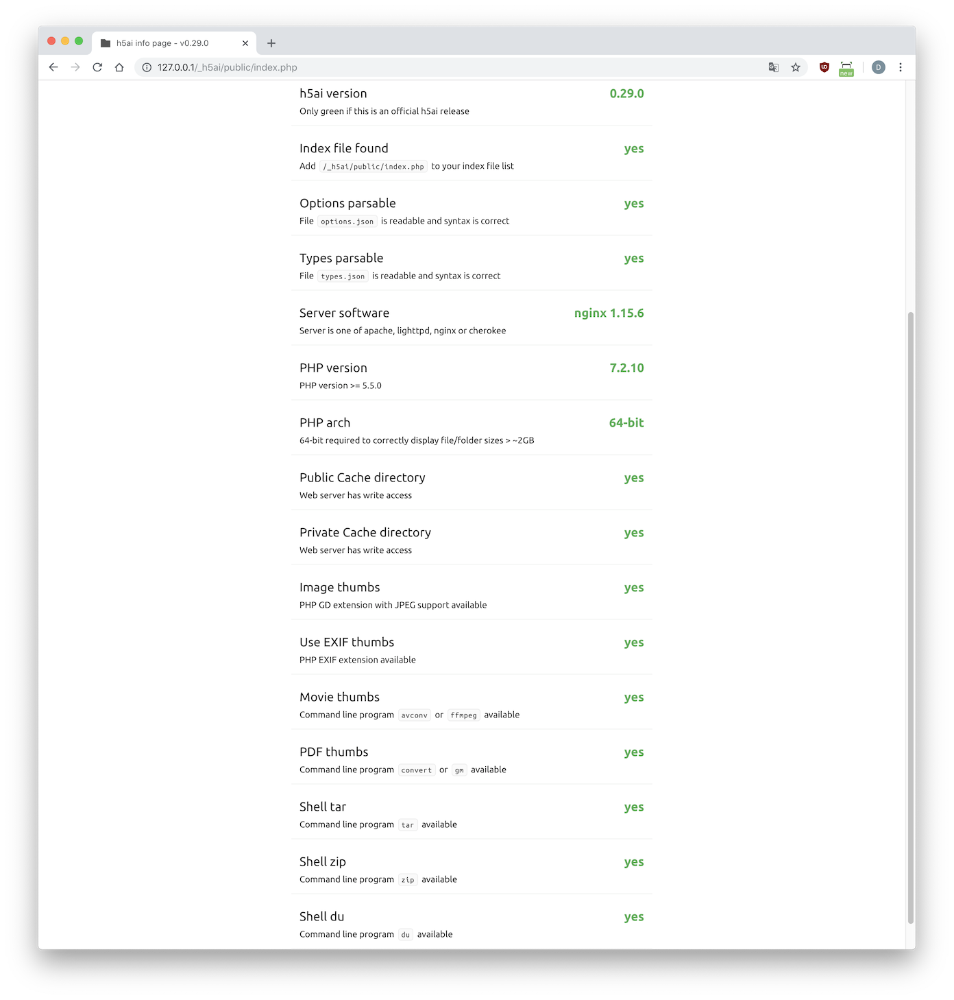
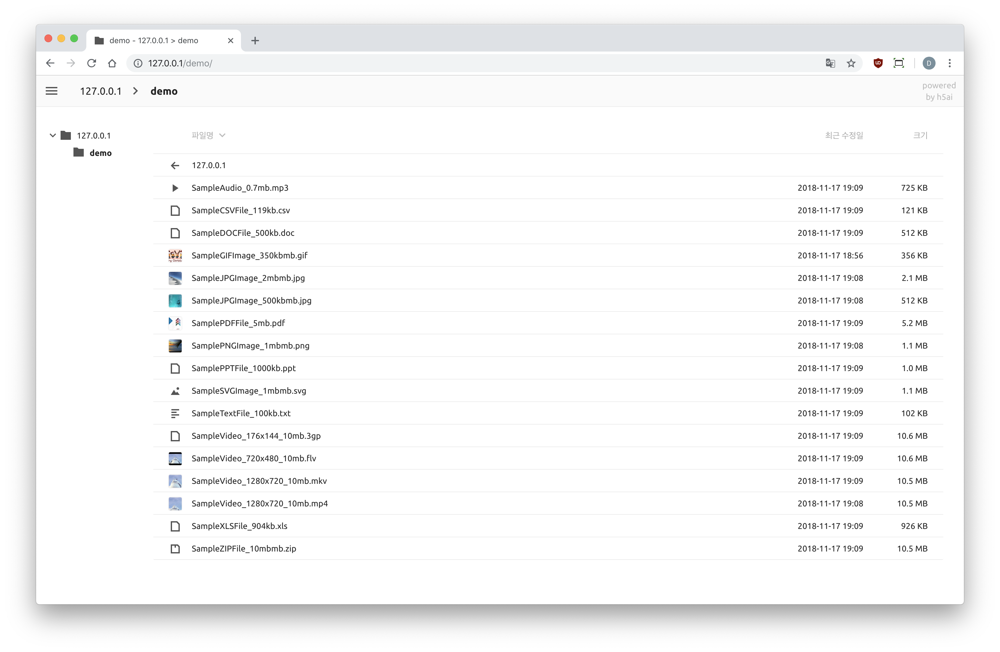

## 基于[awesometic/docker-h5ai](https://github.com/awesometic/docker-h5ai)改版，适用绝大部分平台，包括但不限于s9xxx等。每周三、周日早上自动更新集成插件到最新版。原作者只支持x64       
如需使用拉取镜像请移步我的[dockerhub仓库](https://hub.docker.com/repository/docker/bin20088/h5ai)查看。    

## What is h5ai

I'd like to quote the [official website](https://larsjung.de/h5ai/).  
> h5ai is a modern file indexer for HTTP web servers with focus on your files. Directories are displayed in a appealing way and browsing them is enhanced by different views, a breadcrumb and a tree overview. Initially h5ai was an acronym for HTML5 Apache Index but now it supports other web servers too.

## What this project provided for

I hope this project would be useful for those who uses docker for building their server.  

## Features

### Core packages

I chose Alpine Linux for make it a **light-weight** service.  
And I do choose nginx-alpine as its base image for the sake of some tweaks of Nginx version.  

So this is composed of,

* Alpine Linux 3.12
* Nginx 1.19.6
* PHP 7.3.26

with,

* h5ai 0.29.2

'x' at the last of their version means that they could be upgraded by their maintainer.  

And I use supervisor to manage these processes. Especially, PHP-FPM7.  
This is the first time for me for using supervisor so I couldn't sure it is needed, but it looks just works. If you have any ideas, please let me know :)  

### All functions work


h5ai supports extensional functions such as showing thumnails of audio and video, caching for better speed, etc. This image functions all of them.

## How can I use this

First of all, it assumes that you have installed Docker on your system.  
Pull the image from docker hub.

```bash
docker pull bin2008/h5ai
```

Run that image temporary. '--rm' option removes container when you terminate the interactive session.

### Basic usage

If you want to run this image as a daemon, try to the followings.

```bash
docker run -d --name=h5ai \
-p 80:80 \
-v /wherever/you/share:/h5ai \
-v /wherever/you/config:/config \
bin2008/h5ai
```

Be aware of that **HTPASSWD** must be true for authenticating,you can set the password for Htpasswd by passing a environment variable.

```bash
docker run -d --name=h5ai \
-p 80:80 \
-v /wherever/you/share:/h5ai \
-v /wherever/you/config:/config \
-e HTPASSWD=true \
-e HTPASSWD_USER=awesometic \
-e HTPASSWD_PW=awesometic \
bin2008/h5ai
```

In this way, all the setting process for Htpasswd will be processed automatically. So you should put **-d** option to run in daemon mode.

Then when the container runs, just let your browser browses:

``` http
http://localhost/
```


Then you can see the directories you shared.

## TODOs

* [x] Easy access to options.json
* [x] Access permission using htpasswd
* [ ] Support HTTPS - This image doesn't support SSL even if the generated cert files are preprared but you can apply SSL if you have external Let's Encrypt program and/or a reverse proxy server.
